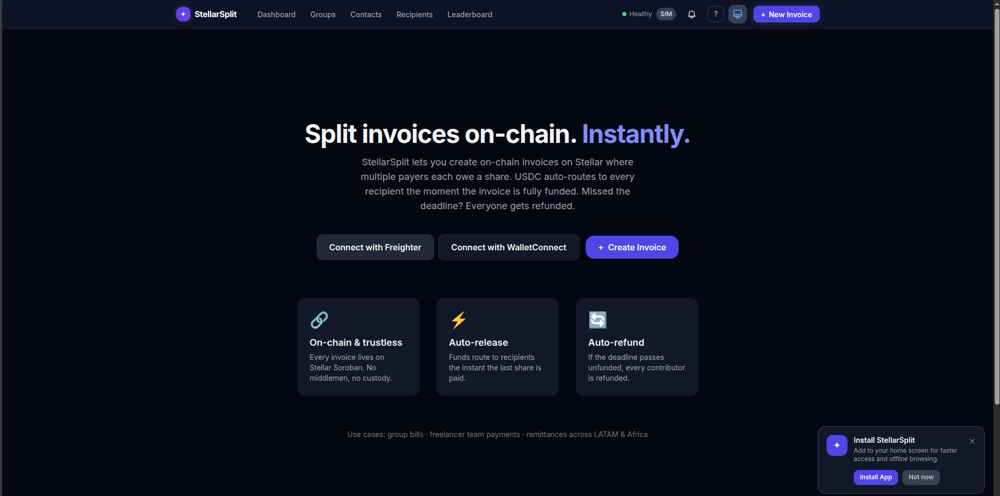

# split-app


Next.js 14 frontend dApp for **StellarSplit** — on-chain invoice & payment splitting on Stellar.

## Live Demo

> [https://stellarsplit-dapp.vercel.app](https://stellarsplit-dapp.vercel.app)

## Screenshots



## Tech Stack

| Layer | Technology |
|-------|-----------|
| Framework | Next.js 14 (App Router) |
| Language | TypeScript 5 |
| Styling | Tailwind CSS 3 |
| Wallet | Freighter (`@stellar/freighter-api`) |
| Contract SDK | `@stellar-split/sdk` |
| Deploy | Vercel |

## Local Setup

### Prerequisites

- Node.js 20+
- [Freighter wallet](https://freighter.app) browser extension

### Install & Run

```bash
git clone https://github.com/stellar-split/split-app.git
cd split-app
npm install
cp .env.example .env.local
# Edit .env.local with your testnet values
npm run dev
```

Open [http://localhost:3000](http://localhost:3000).

### Environment Variables

| Variable | Description |
|----------|-------------|
| `NEXT_PUBLIC_STELLAR_NETWORK` | `testnet` or `mainnet` |
| `NEXT_PUBLIC_CONTRACT_ID` | Deployed StellarSplit contract ID |
| `NEXT_PUBLIC_RPC_URL` | Soroban RPC endpoint URL |

## Pages

| Route | Description |
|-------|-------------|
| `/` | Landing page with CTA |
| `/dashboard` | User's sent and received invoices |
| `/invoice/new` | Create a new invoice |
| `/invoice/[id]` | Invoice detail, payment progress, Pay button |
| `/verify/[id]` | Public on-chain verification (no login needed) |

## Run Lint

```bash
npm run lint
```

## Build

```bash
npm run build
```

## Contributing via Drips Wave

This project participates in the [Drips Wave Program](https://drips.network/wave) by the Stellar Development Foundation. Contributors can earn rewards by completing open issues.

See [CONTRIBUTING.md](./CONTRIBUTING.md) for the full guide.

**Do not start coding until assigned to an issue by a maintainer.**
